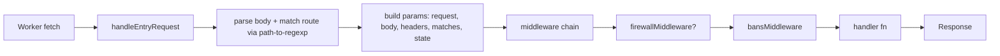

# Apiker development

Apiker is a **library** that lets developers build serverless APIs on Cloudflare Workers +
Durable Objects with minimal boilerplate. This skill is for working **on the library itself**
(this repo), not on a consumer app.

Read `.agents/AGENTS.md` first if you haven't — it has the repo map, commands, and hard rules.

## Mental model (how a request flows)

Key facts an agent must internalize:

- **Single global instance.** `apiker` is a singleton (`src/components/Apiker/Apiker.ts`).
  `apiker.init(options)` wires routes, exports Durable Object classes, and installs the
  `fetch`/`scheduled` handlers onto the consumer's `exports` object.
- **Routes** map a `path-to-regexp` pattern → either a **handler function**
  `(params) => Response` or a `"ControllerClass.method"` string resolved against
  `apiker.controllers`.
- **`params`** passed to every handler: `{ request, body, headers, matches, state }`
  (see `RequestParams` in `src/components/Request/interfaces.ts`). `matches.params` holds
  route params like `:id`.
- **Middleware** is a simple array run in order by `forwardToMiddleware`; the **first
  middleware to return a truthy `Response` wins**. Order: firewall (if enabled) → bans →
  handler.
- **State = Durable Objects.** `state(objectName?, objectId?, isCloudflareId?)` returns
  `{ get, put, delete, deleteAll, list }`. These proxy over `fetch()` to the `ObjectBase`
  Durable Object, which persists via `state.storage`. All methods are **async**.
- **`objectStateMapping`** decides which DO instance an object name resolves to
  (`signedIp`, `clientId`, `ip`, a route-param name, or a literal). Defaults live in
  `Apiker.init`.
- **Responses** are always built via the `res*` helpers (`src/components/Response`),
  never raw `new Response` in handlers (except `resRaw` for HTML).

For the full breakdown read `references/architecture.md`.

## Where to make changes

| I want to… | Go to |
|------------|-------|
| Add/modify built-in routes | the domain's `index.ts` (e.g. `Auth/Auth.ts` `getApikerAuthRoutes`) |
| Add a response helper / status | `src/components/Response/Response.ts` + `constants.ts` |
| Change request parsing/routing | `src/components/Request/Request.ts` |
| Add a middleware | create `middleware.ts` in the domain, push it in `Request.ts` |
| Change DO storage behavior | `src/components/State/State.ts` + `ObjectBase/ObjectBase.ts` |
| Add init options | `Options` in `Apiker/interfaces.ts` + handle in `Apiker.init` |
| Add a new feature domain | new folder under `components/`, export from `components/index.ts` |
| Change the scaffolder | `scripts/create.js` (Node context, not Workers) |

## Rules that bite if ignored

1. **Workers runtime only** in `src/components/**` — no Node built-ins (`fs`, `path`,
   `process`, `Buffer`). Node APIs are allowed only in `scripts/` and `bin/`.
2. **No new dependencies** (`CONTRIBUTING.md`). Reach for Web/Workers APIs or existing deps
   (`path-to-regexp`, `cookie`, `cfw-bcrypt`, `cfw-crypto`).
3. **Preserve the public contract.** Don't rename exports, change `res*` signatures, or alter
   the handler `params` shape without maintainer sign-off. Downstream APIs depend on them.
4. **Every new public export needs TSDoc** and a `components/index.ts` re-export path.
5. **Async everywhere for state.** Never forget to `await` a `state().get/put/...`.
6. **Add a test** under `<Domain>/tests/` and run `npm test` before finishing.

## Working process

1. **Locate** the domain folder; read its `index.ts`, `interfaces.ts`, and implementation.
2. **Follow the existing pattern** in that folder — Apiker is highly consistent.
3. **Implement** the smallest change that satisfies the request.
4. **Document** new/changed public APIs with TSDoc (`references/documentation.md`).
5. **Test**: add/adjust a Jest test, then `npm test`.
6. **Verify types**: the build uses TypeScript; keep it type-clean.
7. **Record learnings** if you hit a non-obvious gotcha
   (`.agents/skills/apiker-self-improve/SKILL.md`).

## Reference files

- `references/architecture.md` — deep dive: init, routing, middleware, Durable Object state,
  object-state mapping, scheduled handlers, response pipeline.
- `references/patterns.md` — copy-ready recipes: add a route, a controller, a middleware,
  a response helper, a state-backed feature, a new component domain.
- `references/testing.md` — Jest setup, the global `exports` mock, how to test handlers and
  state, running/focusing tests.
- `references/documentation.md` — doc-comment style for developer IntelliSense (user docs live
  at hodgef.com/apiker, maintained in PRSS).
